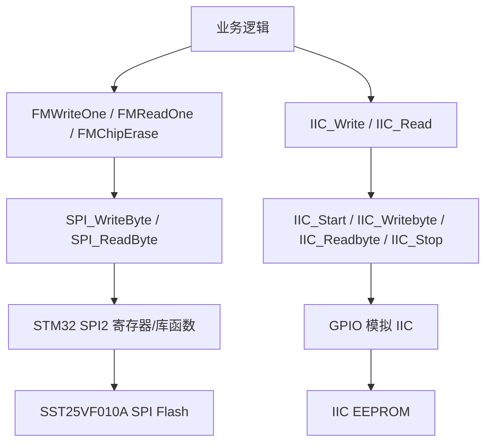
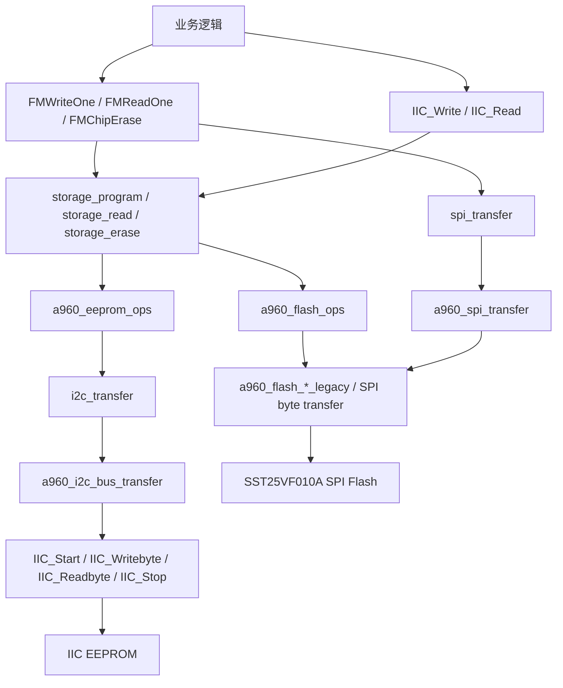

# A960 SPI/IIC Storage Architecture Migration

本文说明 A960 工程中 SPI Flash 和 IIC EEPROM 存储访问在移植架构前后的结构差异。

说明：A960 工程此前未纳入 Git 跟踪，因此没有可直接对比的历史提交。本文中的“修改前结构”依据当前代码中保留的 legacy 访问函数、旧接口函数名和原始调用链进行还原；“修改后结构”依据当前工程中的实际代码与工程文件配置说明。

## 涉及文件

本次存储架构移植涉及以下主要文件：

| 类型 | 文件 |
| --- | --- |
| SPI Flash 业务适配 | `Example/ref/EZPro100HID_FW_APP_A960/Project/EZPro10_v910/src/spi.c` |
| IIC EEPROM 业务适配 | `Example/ref/EZPro100HID_FW_APP_A960/Project/EZPro10_v910/src/wx_i2c.c` |
| 通用存储抽象 | `Example/ref/EZPro100HID_FW_APP_A960/Project/EZPro10_v910/UserModules/hw_abstraction/storage/include/storage.h` |
| 通用存储实现 | `Example/ref/EZPro100HID_FW_APP_A960/Project/EZPro10_v910/UserModules/hw_abstraction/storage/src/storage.c` |
| SPI transport 抽象 | `Example/ref/EZPro100HID_FW_APP_A960/Project/EZPro10_v910/UserModules/hw_abstraction/bus/spi/include/spi_transport.h` |
| SPI transport 实现 | `Example/ref/EZPro100HID_FW_APP_A960/Project/EZPro10_v910/UserModules/hw_abstraction/bus/spi/src/spi_transport.c` |
| I2C transport 抽象 | `Example/ref/EZPro100HID_FW_APP_A960/Project/EZPro10_v910/UserModules/hw_abstraction/bus/i2c/include/i2c_transport.h` |
| I2C transport 实现 | `Example/ref/EZPro100HID_FW_APP_A960/Project/EZPro10_v910/UserModules/hw_abstraction/bus/i2c/src/i2c_transport.c` |
| 通用状态码 | `Example/ref/EZPro100HID_FW_APP_A960/Project/EZPro10_v910/UserModules/hw_abstraction/common/include/hw_status.h` |
| Keil 工程 | `Example/ref/EZPro100HID_FW_APP_A960/Project/EZPro10_v910/MDK-ARM/EZPro100_v20.uvprojx` |
| IAR 工程 | `Example/ref/EZPro100HID_FW_APP_A960/Project/EZPro10_v910/EWARM/EZPro100_v20.ewp` |

## 修改前结构

修改前的存储访问是业务接口直接驱动底层总线时序：



### SPI Flash 修改前特点

旧结构中，Flash 访问逻辑集中在 `spi.c`：

- `FMWriteOne()` 直接发送写使能、写命令、地址和数据。
- `FMReadOne()` 直接发送读命令和地址，再通过 `SPI_ReadByte()` 得到 `Rxdata`。
- `FMChipErase()` 直接发送写使能和整片擦除命令。
- `SPI_WriteByte()` / `SPI_ReadByte()` 直接等待 SPI2 的 `TXE` / `RXNE` 标志并访问 SPI2 数据寄存器。
- 上层业务依赖 `FMWriteOne()`、`FMReadOne()`、`FMChipErase()` 这些具体 Flash 接口。

代码中保留的 legacy 函数反映了原始访问方式：

- `a960_flash_write_one_legacy()`
- `a960_flash_read_legacy()`
- `a960_flash_chip_erase_legacy()`

### IIC EEPROM 修改前特点

旧结构中，EEPROM 访问逻辑集中在 `wx_i2c.c`：

- `IIC_Write()` 直接发起 start、写设备地址、写字地址、写数据、stop。
- `IIC_Read()` 直接发起写字地址后再读一个字节。
- `IIC_Write_Array()` / `IIC_Read_Array()` 保留了多字节访问流程。
- IIC 时序由 GPIO bit-bang 实现，包括 `IIC_Start()`、`IIC_Stop()`、`IIC_Writebyte()`、`IIC_Readbyte()`、ACK/NOACK。
- 上层业务依赖 `IIC_Write()`、`IIC_Read()` 这些具体 EEPROM 接口。

## 修改后结构

修改后增加了两层抽象：

- `storage`：统一表达存储设备的 `init/read/program/erase/info` 能力。
- `transport`：统一表达 SPI/I2C 总线传输，但实际总线时序仍由 A960 原函数执行。



### SPI Flash 修改后结构

`spi.c` 中新增了一个 Flash 存储对象：

```c
static Storage a960_flash_storage;
static const StorageOps a960_flash_ops =
{
    a960_flash_init,
    a960_flash_read,
    a960_flash_program,
    a960_flash_erase
};
```

Flash 能力由 `a960_flash_init()` 填入：

- 容量：`A960_FLASH_CAPACITY_BYTES = 0x00020000`
- 页大小：`A960_FLASH_PAGE_SIZE_BYTES = 1`
- 擦除大小：整片容量
- 能力：`READ | PROGRAM | ERASE | REQUIRES_ERASE`
- 擦除值：`0xff`

旧的对外接口仍然保留，但内部改为调用 storage：

| 对外接口 | 修改后内部调用 |
| --- | --- |
| `FMWriteOne(FMAddr, FMData)` | `storage_program(A960_FlashStorage(), FMAddr, &FMData, 1)` |
| `FMReadOne(FMAddr)` | `storage_read(A960_FlashStorage(), FMAddr, &data, 1)` |
| `FMChipErase()` | `storage_erase(A960_FlashStorage(), 0, A960_FLASH_CAPACITY_BYTES)` |

实际 Flash 命令时序没有重写，而是继续由 legacy 函数完成：

| storage ops | 实际执行 |
| --- | --- |
| `a960_flash_read()` | `a960_flash_read_legacy()` |
| `a960_flash_program()` | 循环调用 `a960_flash_write_one_legacy()` |
| `a960_flash_erase()` | `a960_flash_chip_erase_legacy()` |

因此修改后的 SPI Flash 逻辑保持原有命令顺序、片选控制、写使能、读写状态等待方式不变，只是在旧接口和底层时序之间增加了统一 storage ops 入口。

### SPI transport 的作用

`spi_transport` 提供统一的 SPI 传输入口：

```c
HwStatus spi_transfer(const SpiDevice *device,
                      const SpiSegment *segments,
                      size_t segment_count,
                      uint32_t timeout_ms);
```

A960 中的适配函数是：

```c
static HwStatus a960_spi_transfer(void *ctx,
                                  const SpiDevice *device,
                                  const SpiSegment *segments,
                                  size_t segment_count,
                                  uint32_t timeout_ms);
```

它把 `SpiSegment` 拆成逐字节发送，最终仍然调用 SPI2 原始等待和收发逻辑。`SPI_WriteByte()` / `SPI_ReadByte()` 的函数名与返回语义保留，内部改为通过 `spi_transfer()` 发送 1 字节。

### IIC EEPROM 修改后结构

`wx_i2c.c` 中新增了一个 EEPROM 存储对象：

```c
static Storage a960_eeprom_storage;
static const StorageOps a960_eeprom_ops =
{
    a960_eeprom_init,
    a960_eeprom_read,
    a960_eeprom_program,
    0
};
```

EEPROM 能力由 `a960_eeprom_init()` 填入：

- 容量：`A960_EEPROM_CAPACITY_BYTES = 0x00010000`
- 页大小：`1`
- 擦除大小：`0`
- 能力：`READ | PROGRAM`
- 擦除值：`0xff`

旧的对外接口仍然保留，但内部改为调用 storage：

| 对外接口 | 修改后内部调用 |
| --- | --- |
| `IIC_Write(Address, Data)` | `storage_program(A960_EepromStorage(), Address, &Data, 1)` |
| `IIC_Read(Address)` | `storage_read(A960_EepromStorage(), Address, &Data, 1)` |

EEPROM 没有提供 erase ops，因此 `a960_eeprom_ops.erase = 0`，通过 storage 调用擦除会返回 `STORAGE_UNSUPPORTED`。

### I2C transport 的作用

`i2c_transport` 提供统一的 I2C 传输入口：

```c
HwStatus i2c_transfer(const I2cDevice *device,
                      const I2cMessage *messages,
                      size_t message_count,
                      uint32_t timeout_ms);
```

A960 中的适配函数是：

```c
static HwStatus a960_i2c_bus_transfer(void *ctx,
                                      const I2cDevice *device,
                                      const I2cMessage *messages,
                                      size_t message_count,
                                      uint32_t timeout_ms);
```

它把 `I2cMessage` / `I2cSegment` 转成原有 GPIO 模拟 IIC 时序：

- `IIC_Start()`
- `IIC_Writebyte()`
- `IIC_Wait_ack()`
- `IIC_Readbyte()`
- `IIC_Send_ack()` / `IIC_Send_noack()`
- `IIC_Stop()`

因此修改后的 EEPROM 读写仍然使用原来的 bit-bang IIC，只是通过 `i2c_transfer()` 统一组织读写消息。

## 核心区别总结

| 对比项 | 修改前 | 修改后 |
| --- | --- | --- |
| 上层接口 | 直接调用 `FM*` / `IIC_*` | 仍保留 `FM*` / `IIC_*`，内部转到 `storage_*` |
| 存储抽象 | 无统一抽象，每个器件各自实现 | 统一为 `Storage` + `StorageOps` |
| SPI 总线抽象 | `SPI_WriteByte()` / `SPI_ReadByte()` 直接访问 SPI2 | 增加 `spi_transfer()`，A960 适配层最终仍访问 SPI2 |
| IIC 总线抽象 | GPIO bit-bang 函数直接被 EEPROM 读写调用 | 增加 `i2c_transfer()`，A960 适配层最终仍调用 bit-bang 函数 |
| 错误码 | 多数接口返回 `0/1` 或无返回值 | 抽象层使用 `StorageStatus` / `HwStatus`，旧接口继续兼容原返回语义 |
| 设备信息 | 分散在代码和宏中 | 通过 `StorageInfo` 描述容量、页大小、擦除粒度和能力 |
| 逻辑变化 | 直接执行旧读写流程 | 底层读写时序保持不变，只增加统一入口和参数校验 |
| 可扩展性 | 新设备需要复制一套专用接口 | 新设备只需实现对应 `StorageOps` 和 bus adapter |

## 调用链对比

### Flash 写 1 字节

修改前：

```text
FMWriteOne()
  -> SPI_WriteByte(WRENCMD)
  -> SPI_WriteByte(ByteProgramCMD)
  -> SPI_WriteByte(address[23:16])
  -> SPI_WriteByte(address[15:8])
  -> SPI_WriteByte(address[7:0])
  -> SPI_WriteByte(data)
```

修改后：

```text
FMWriteOne()
  -> storage_program(A960_FlashStorage(), address, &data, 1)
  -> a960_flash_program()
  -> a960_flash_write_one_legacy()
  -> SPI_WriteByte(...)
  -> spi_transfer(...)
  -> a960_spi_transfer()
  -> a960_spi_transfer_byte()
```

### Flash 读 1 字节

修改前：

```text
FMReadOne()
  -> SPI_WriteByte(ReadCMD)
  -> SPI_WriteByte(address[23:16])
  -> SPI_WriteByte(address[15:8])
  -> SPI_WriteByte(address[7:0])
  -> SPI_ReadByte()
  -> Rxdata
```

修改后：

```text
FMReadOne()
  -> storage_read(A960_FlashStorage(), address, &data, 1)
  -> a960_flash_read()
  -> a960_flash_read_legacy()
  -> SPI_WriteByte(...)
  -> SPI_ReadByte()
  -> spi_transfer(...)
  -> a960_spi_transfer()
  -> Rxdata = data
```

### EEPROM 写 1 字节

修改前：

```text
IIC_Write()
  -> IIC_Start()
  -> IIC_Writebyte(IIC_Write_Address)
  -> IIC_Writebyte(word_address)
  -> IIC_Writebyte(data)
  -> IIC_Stop()
```

修改后：

```text
IIC_Write()
  -> storage_program(A960_EepromStorage(), address, &data, 1)
  -> a960_eeprom_program()
  -> i2c_transfer(...)
  -> a960_i2c_bus_transfer()
  -> IIC_Start()
  -> IIC_Writebyte(device_address)
  -> IIC_Writebyte(word_address)
  -> IIC_Writebyte(data)
  -> IIC_Stop()
```

### EEPROM 读 1 字节

修改前：

```text
IIC_Read()
  -> IIC_Start()
  -> IIC_Writebyte(IIC_Write_Address)
  -> IIC_Writebyte(word_address)
  -> IIC_Start()
  -> IIC_Writebyte(IIC_Read_Address)
  -> IIC_Readbyte()
  -> IIC_Stop()
```

修改后：

```text
IIC_Read()
  -> storage_read(A960_EepromStorage(), address, &data, 1)
  -> a960_eeprom_read()
  -> i2c_transfer(write word address + read data)
  -> a960_i2c_bus_transfer()
  -> IIC_Start()
  -> IIC_Writebyte(device_address write)
  -> IIC_Writebyte(word_address)
  -> IIC_Start()
  -> IIC_Writebyte(device_address read)
  -> IIC_Readbyte()
  -> IIC_Stop()
```

## 工程配置变化

### Keil 工程

`MDK-ARM/EZPro100_v20.uvprojx` 新增本地 include path：

- `..\UserModules\hw_abstraction\storage\include`
- `..\UserModules\hw_abstraction\bus\spi\include`
- `..\UserModules\hw_abstraction\bus\i2c\include`
- `..\UserModules\hw_abstraction\common\include`

并新增编译文件：

- `..\UserModules\hw_abstraction\storage\src\storage.c`
- `..\UserModules\hw_abstraction\bus\spi\src\spi_transport.c`
- `..\UserModules\hw_abstraction\bus\i2c\src\i2c_transport.c`

### IAR 工程

`EWARM/EZPro100_v20.ewp` 对所有配置补充相同 include path，并新增 `HwAbstraction` 分组，包含：

- `storage.c`
- `spi_transport.c`
- `i2c_transport.c`

## 保持不变的部分

本次移植的目标是架构接入，不改变业务逻辑。以下内容保持原有行为：

- Flash 的命令字、地址发送顺序、片选控制、写使能流程不变。
- Flash 读写仍以旧的单字节读写逻辑为基础。
- Flash 整片擦除仍使用原来的 chip erase 流程。
- EEPROM 仍使用 GPIO 模拟 IIC。
- EEPROM 单字节读写的 start、address、ack、stop 时序由原函数执行。
- 上层业务仍可继续调用 `FMWriteOne()`、`FMReadOne()`、`FMChipErase()`、`IIC_Write()`、`IIC_Read()`。

## 引入后的收益

本次修改主要带来结构收益：

- 统一存储访问接口，Flash 和 EEPROM 都通过 `Storage` 表达。
- 上层未来可以基于 `storage_read()` / `storage_program()` 访问不同存储介质。
- 设备能力集中在 `StorageInfo`，便于统一查询容量、页大小、擦除能力。
- 总线访问通过 `spi_transport` / `i2c_transport` 形成边界，后续替换硬件 SPI/IIC 实现时影响范围更小。
- 旧业务接口保留，降低对现有业务代码的影响。

## 需要注意的点

- 当前 EEPROM 的 `a960_eeprom_read()` / `a960_eeprom_program()` 仍按单字节循环处理，保持旧逻辑优先，没有改成页写优化。
- 当前 Flash 的 `a960_flash_program()` 仍按单字节循环写入，保持旧逻辑优先，没有改成页编程。
- `storage` 层增加了地址范围检查，如果调用地址超过声明容量，会返回 `STORAGE_OUT_OF_RANGE`，这比旧代码更早暴露越界调用。
- `FMReadOne()` 仍维护 `Rxdata` 赋值，以兼容旧代码依赖全局 `Rxdata` 的行为。
- `IIC_Write_Array()`、`IIC_Read_Array()`、`IIC_Clear()` 仍保留原直接 IIC 时序实现，没有强制改走 storage，以避免改变批量访问逻辑。

